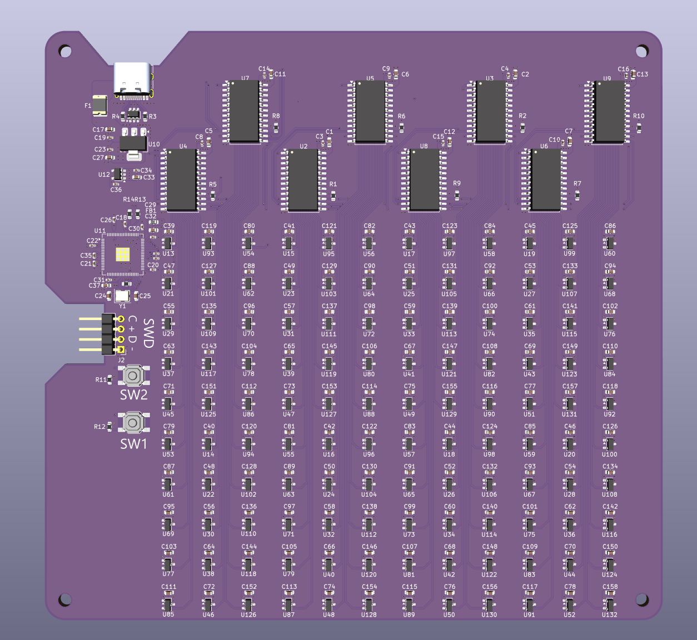

# Tiramisu: a 1000 Hz Hall-effect osu! tablet

<p align="center">
  
</p>

Tiramisu is a drawing tablet for [osu!](https://osu.ppy.sh) that tracks a magnet-tipped pen with a grid of
120 Hall-effect sensors and reports its position over USB **1000 times a second**. That's the USB Full-Speed
ceiling, and 7.5x the 133 Hz of a Wacom CTL-472.

It's my independent prototype of the Hall-effect tablet we're building at
[Wonkle](https://github.com/wonkleio). The board and firmware go by **aim1k** in the source.

## Status

| Board | State |
|---|---|
| `tiramisu-dev-RP2354B` | Fabricated and assembled by JLCPCB, brought up, tracking a magnetic pen |
| `tiramisu-dev-CH32V307` | Next revision, in part selection: a RISC-V MCU with built-in USB 2.0 High-Speed to go past 1 kHz |

## Hardware: `tiramisu-dev-RP2354B`

| | |
|---|---|
| MCU | Raspberry Pi RP2354B (dual Arm Cortex-M33, 2 MB in-package flash) |
| Sensors | 120 x HAL403 linear Hall sensors in a 12 x 10 grid at 10 mm pitch |
| Multiplexing | 8 x CD74HC4067 16:1 analog muxes on a shared select bus, one per ADC input |
| PCB | 4 layers, 154 x 147 mm, designed in KiCad |
| Interface | USB-C (Full-Speed): HID plus an optional CDC debug console. SWD header for debugging |

## How it works

- **Scan (core 1).** DMA-driven round-robin over all 120 sensors at about 1.8 kHz per full frame, keeping a
  baseline and a noise sigma for every sensor. A warm-up conversion pass removes the crosstalk that the
  multiplexers' on-resistance causes in the ADC's sample-and-hold.
- **Solve (core 0).** Detects the pen from per-sensor noise thresholds and spatial coherence, seeds a position
  from the centroid, then refines x, y and hover height with a Levenberg-Marquardt fit of a magnetic dipole. A
  1-Euro filter smooths the output without adding lag during fast flicks.
- **Report.** 1 kHz USB HID, paced by the host's polling. The device exposes two collections: an absolute mouse
  that works with no driver, and a vendor-defined collection for [OpenTabletDriver](https://opentabletdriver.net).

The [firmware README](tiramisu-dev-RP2354B/firmware/README.md) covers the solver, the tuning decisions and how
to test without hardware. The [sensing calculations](tiramisu-dev-RP2354B/docs/CALCULATIONS.md) cover grid
geometry, scan-rate budget and magnet choice.

## Repository layout

```
tiramisu-dev-RP2354B/
  pcb/               KiCad project: schematic and 4-layer layout
  manufacturing/     Gerbers, BOM and pick-and-place files for JLCPCB
  firmware/          C firmware on the Pico SDK and TinyUSB
  scripts/           Python host tools
  opentabletdriver/  OpenTabletDriver tablet config and report parser
  docs/              Sensing and scan-rate calculations
  datasheets/
tiramisu-dev-CH32V307/   Next revision (datasheets so far)
images/                  Photos and renders for this README
```

## Build and flash

The build uses the Raspberry Pi Pico SDK. The Pico VS Code extension installs the SDK, the Arm toolchain, CMake
and Ninja in one go.

```powershell
cd tiramisu-dev-RP2354B/firmware
.\build.ps1           # configure (first time) and build
.\build.ps1 -Clean    # wipe build/ and reconfigure
```

Hold **BOOTSEL**, plug the board in, and copy `build/aim1k.uf2` onto the drive that appears.

## Host tools

All of these are Python 3 with no third-party packages. The USB tools use Windows APIs.

| Script | What it does |
|---|---|
| `scripts/grid_view.py` | Live heatmap of the sensor grid over the debug console, plus noise, raw, baseline and recalibrate views |
| `scripts/rate_test.py` | Measures the real HID report rate and its jitter at the host |
| `scripts/set_mode.py` | Turns the driverless mouse collection on or off |
| `scripts/gen_sensor_map.py` | Regenerates the firmware's sensor map straight from the KiCad PCB |
